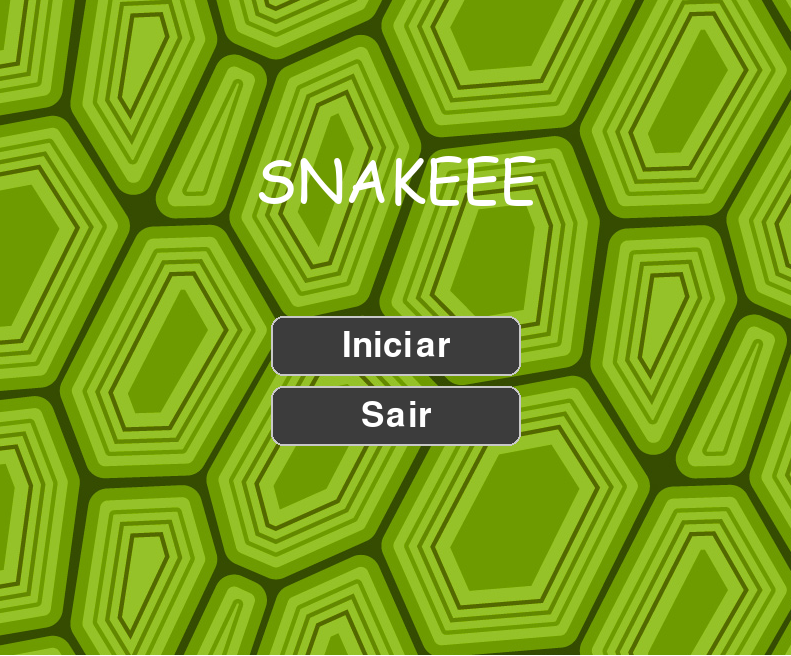
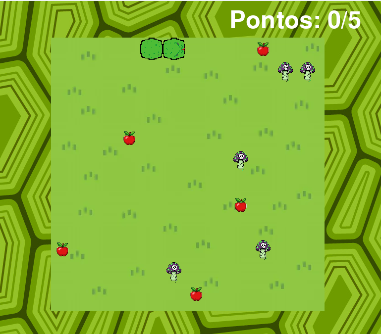

# 🐍 Snake Game – Python + Pygame

Este projeto é uma versão personalizada do clássico **Snake**, desenvolvida em **Python** com **Pygame** como parte do meu aprendizado em lógica de programação, matrizes, game loop e construção de interfaces interativas.

---

## 🚀 Funcionalidades

- Menu inicial estilizado  
- Seleção de dificuldade (Fácil / Média / Difícil)  
- Fruta boa (aumenta o tamanho)  
- Fruta ruim (reduz o tamanho ou causa derrota)  
- Sistema de pontuação  
- Tela de vitória  
- Tela de Game Over  
- Modo pause  
- Botões interativos (iniciar, tentar novamente, sair)  
- Sons, música de fundo e sprites personalizados  
- Uso de matriz para renderização do tabuleiro  
- Lógica completa da cobra criada manualmente  

---

## 🎮 Controles

| Ação | Tecla |
|------|-------|
| Cima | **W** |
| Baixo | **S** |
| Esquerda | **A** |
| Direita | **D** |
| Pausar | **ESC** |

---

## 🧠 Conceitos Aplicados

- Game loop com FPS  
- Manipulação de eventos do teclado  
- Estados do jogo:  
  - MENU  
  - MENU_DIFICULDADE  
  - PREJOGO  
  - JOGO  
  - PAUSE  
  - GAME_OVER  
  - WINNER  
- Matrizes para tabuleiro  
- Sprites e imagens  
- Regras de vitória e derrota  
- Som ambiente e efeitos  

---

<h2>📸 Screenshots do Jogo</h2>

   
  

